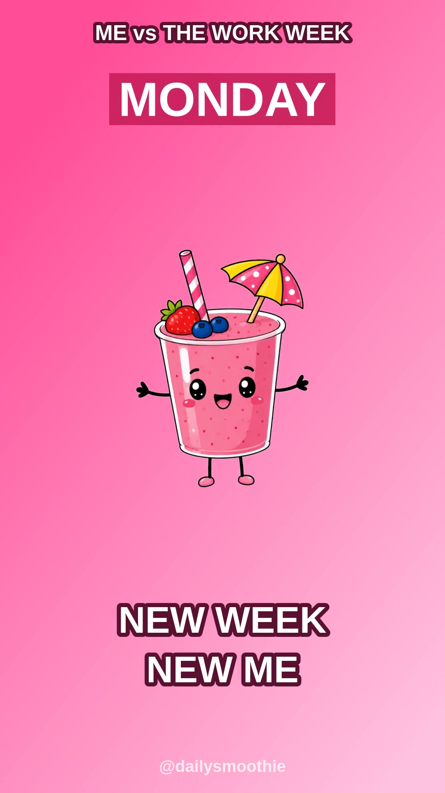

# My Week as a Smoothie — YouTube Short

A vertical 1080×1920 / 30fps / **25s** Short built from four smoothie-character
illustrations and a backing track.



## The hook
Relatable "decline" meme: the same little smoothie deteriorates across the
work week. Each day swaps the character art and the energy of its animation,
and the bounce amplitude shrinks beat by beat so the character visibly runs
out of gas as the week goes on.

| Beat | Day | Art | Animation | Caption |
|------|-----|-----|-----------|---------|
| 0–5s   | MONDAY    | arms-up, hyped     | big fast bounce + excited shimmy | NEW WEEK / NEW ME |
| 5–10s  | TUESDAY   | calm & happy       | happy sway-bounce       | STILL / GOT THIS |
| 10–15s | WEDNESDAY | calm & happy       | wider, unsure wobble    | HALFWAY / THERE... |
| 15–20s | THURSDAY  | sweating, drained  | low trembling jitter    | RUNNING ON / FUMES |
| 20–25s | FRIDAY    | dizzy, knocked over| slow drunk wobble       | I MADE IT / ...BARELY |

## Why 25s (and this pacing)
Shorts are ranked on **average view percentage** and **loops**, not raw watch
time, so a fully-watched 25s clip beats a half-watched 60s one. This cut keeps
five fast ~5s beats and adds motion on every frame so there's no dead air:

- **Punch-in pop** — the character scale-overshoots and settles on every cut
  (a "hit" synced to each day change).
- **Heartbeat pulse** — a subtle continuous scale oscillation keeps it alive.
- **Per-beat motion** — fast bounce → sway → wobble → tremble → drunk-wobble.
- **Spring-in captions** — the day chip drops from the top and the phrase
  springs up from the bottom on each beat.

## Files
- `smoothie_week_short.mp4` — the finished Short (H.264 + AAC, faststart).
- `cover.jpg` — thumbnail.
- `process.py` — flood-fills the solid white image backgrounds to transparent
  via edge-connected labeling, preserving interior whites (eyes, straw,
  umbrella, dizzy spirals).
- `gen_filter.py` — **source of truth** for the animation; emits
  `filter_fast.txt` (the ffmpeg `filter_complex` graph). Tune timing, pops,
  bounce/sway/jitter, and captions here.
- `filter_fast.txt` — generated filtergraph (checked in for reference).
- `build.sh` — end-to-end rebuild.

## Rebuild
Drop the four source PNGs (`f1_hyped.png`, `f2_happy.png`, `f3_tired.png`,
`f4_out.png`) and `audio.mp3` next to the scripts, then:

```bash
./build.sh
```

Needs `ffmpeg` and `python3` with `pillow numpy scipy`.

## Publishing tips
- Upload vertical; YouTube auto-classifies sub-3-min vertical video as a Short.
- Suggested title: **"My week as a smoothie 🥤"**
- Suggested tags: `#shorts #relatable #mood #smoothie #workweek`
- The hook ("ME vs THE WORK WEEK") stays on screen the whole time so scrollers
  get the premise in frame one.
